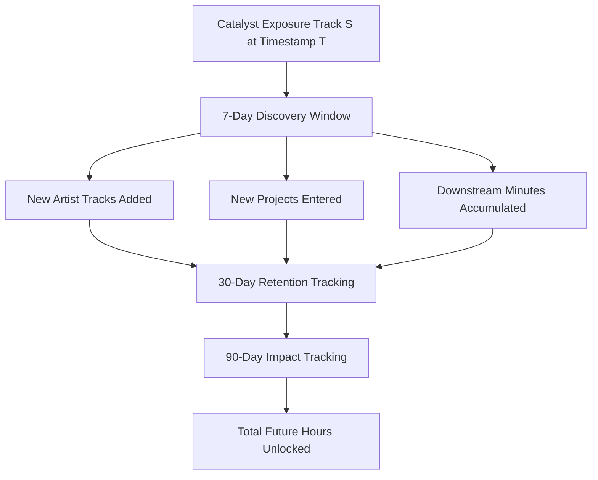

# Spotify Personal Intelligence Engine

> **Behavioral Analytics, Music Discovery Modeling & Personalized Listening Intelligence**  
> *Transforming longitudinal Spotify Extended Streaming History (2020–2026) into behavioral intelligence, discography expansion modeling, and explainable machine learning.*

---

## 🎯 Core Research Question

> **"How does a listener's musical taste actually develop over time?"**

Conventional annual retrospectives (like Spotify Wrapped) present static summary counts: top songs, top artists, total minutes.

The **Spotify Personal Intelligence Engine** models how music enters, expands, survives, declines, and revives within a personal listening ecosystem:
- **Discovery Catalysts**: Which specific song encounters trigger deep exploration into an artist's wider catalog over 7, 30, and 90 days?
- **Discography Exploration**: How are albums and EPs consumed? Which songs drive the majority of project listening?
- **Lifecycle Trajectories**: When do artists peak, enter dormancy, or experience revivals years later?
- **Sequences & Networks**: What transition patterns connect songs and artists, and which bridge artists link disparate musical clusters?
- **Predictive Intelligence**: Can machine learning predict whether a new song exposure will spark catalog expansion within 7 days without future temporal leakage?

---

## 🏗️ System Architecture

```
RAW SPOTIFY JSON (data/raw/...)
   ↓ (Phase 1: Ingestion & Schema Validation)
VALIDATED EVENT STREAM (data/interim/...)
   ↓ (Phase 2 & 3: Normalization & 30-Min Sessionization)
CANONICAL PLAYBACK PARQUET (data/processed/canonical_playback.parquet)
   ↓ (Phase 4 & 5: Feature Store & Analytical Engines)
ANALYTICAL GOLD TABLES (data/processed/...)
   ├── artist_lifecycles.parquet
   ├── song_lifecycles.parquet
   ├── projects.parquet (≥3-track exploration rule)
   ├── project_driving_songs.parquet
   ├── sessions.parquet
   ├── track_transitions.parquet & three_song_sequences.parquet
   ├── genre_time_matrix.parquet & yearly_genre_share.parquet
   ├── network.json & taste_fingerprint.json
   └── discovery_events.parquet & discovery_rankings.parquet
   ↓ (Phase 7: Temporal-Leakage-Free ML Engine)
ML DATASETS & GRADIENT BOOSTED TREES (models/ & data/ml/)
   ├── Chronological Split: Train (2020-2024), Val (2025), Test (2026)
   ├── Baselines: Majority Class, Heuristic, Regularized Logistic Regression
   └── Main Model: LightGBM Classifier (PR-AUC: 0.7302, ROC-AUC: 0.9718)
   ↓ (Phase 8 & 9: Production API & Interactive UI)
FASTAPI BACKEND (src/api/) & 10-VIEW MODERN DASHBOARD (dashboard/)
```

---

## ⚡ Flagship Analytical Concept: Discovery Catalysts

Rather than requiring an immediate consecutive transition ($A \to B$ immediately), the engine evaluates a forward **7-Day Discovery Window** $[T, T + 7\text{ days}]$ for each candidate catalyst exposure:



### Verified Case Studies from Real Dataset:
1. **Panther — *Aa Jao***:
   - **Discovery Type**: Catalog Deepening
   - **7-Day Impact**: 19 new Panther tracks added, 110.34 additional listening minutes
   - **30-Day Impact**: 217.65 minutes, sustained retention
   - **Downstream Hours Unlocked**: **32.57 hours**
2. **Frappe Ash — Catalog Exploration**:
   - **46 Discovery & Re-engagement Events** detected across catalog (*Surma*, *Karein Kya*, *Downlow*, *Jungle*), unlocking **33.18 hours** of downstream listening.

---

## 🤖 Machine Learning Benchmarks (Test Set: 2026)

Evaluated strictly on unseen future data (2026) with zero temporal leakage:

| Model Architecture | PR-AUC | ROC-AUC | Precision | Recall | F1 Score | Brier Score |
|---|---|---|---|---|---|---|
| 1. Majority Class Baseline | 0.0642 | 0.5000 | 0.0000 | 0.0000 | 0.0000 | 0.0601 |
| 2. Heuristic Transition Baseline | 0.0605 | 0.4752 | 0.0603 | 0.0304 | 0.0404 | 0.0812 |
| 3. Regularized Logistic Regression | 0.6088 | 0.9620 | 0.4560 | 0.8547 | 0.5947 | 0.0694 |
| **4. LightGBM Gradient Boosted Trees (Main)** | **0.7302** | **0.9718** | **0.5385** | **0.8503** | **0.6594** | **0.0315** |

### Leakage Prevention Verification:
- **Chronological Monotonicity**: Verified.
- **Zero Initial Pre-Play Counter Invariant**: $song\_plays\_before = 0$ on first exposure verified.
- **Audit Status**: **PASSED (Zero Temporal Leakage)**.

---

## 🚀 Quick Start

### 1. Installation
```powershell
git clone https://github.com/your-username/spotify-personal-intelligence.git
cd spotify-personal-intelligence
pip install -r requirements.txt
```

### 2. Run Data Pipeline
Processes raw JSON, builds canonical playback tables, computes lifecycles, sessions, networks, and discovery catalysts:
```powershell
python scripts/run_pipeline.py
```

### 3. Train Machine Learning Models
Runs temporal split dataset generation, baseline training, LightGBM training, and leakage audit:
```powershell
python scripts/run_ml.py
```

### 4. Run Automated Test Suite
```powershell
pytest -v
```

### 5. Launch Interactive Dashboard & REST API
```powershell
python scripts/start_server.py
```
Open **http://127.0.0.1:8000** in your browser to view the interactive dashboard.

---

## 📊 Interactive Dashboard Views

1. **🧬 Spotify DNA Overview**: Headline KPIs (908+ hours, 1,784 artists, 329 explored projects), 8-axis Taste Fingerprint radar, listening intensity, yearly evolution.
2. **⚡ Discovery Catalysts**: Top catalyst rankings, 7D/30D/90D metrics, unlocked future hours, Panther & Frappe Ash spotlights.
3. **🎤 Artist Lifecycle**: Trajectory curves, peak month detection, longest inactivity gap, time-of-day profile, discography breakdown.
4. **💿 Albums & EPs**: Enforcement of the non-negotiable $\ge 3$-track rule, penetration % vs completion %, top driving songs.
5. **🎵 Song Lifecycles**: Raw vs Active lifespan comparison, obsession detection, evergreen favorites, skip behavior.
6. **🔁 Listening Sequences**: Top 2-track transition probabilities, 3-song Markov sequence chains ($A \to B \to C$).
7. **🕸️ Music Network**: Force-directed topological graph, community clustering, betweenness bridge artists.
8. **🕒 Genre × Time × Year**: 8 diurnal 3-hour time buckets, annual genre migration trajectories.
9. **🔍 Deep Dive Explorer**: Multi-level hierarchical drill-down from Artist $\to$ Project $\to$ Song $\to$ Discovery Event.
10. **🤖 ML Intelligence & Playground**: Benchmark comparison table, feature importance, temporal leakage audit certificate, and interactive real-time prediction simulator.

---

## 🔒 Privacy & Public Data Governance

- **Zero Raw Data Publishing**: Raw JSON files with personal IP addresses are strictly `.gitignored`.
- **Public Sample Dataset**: Anonymized public sample provided in `data/sample/sample_streaming_history.json` with redacted IP addresses (`0.0.0.0`) for public testing.

---

## 📁 Repository Structure

```
spotify-personal-intelligence/
├── README.md
├── LICENSE
├── pyproject.toml
├── requirements.txt
├── Dockerfile
├── docker-compose.yml
│
├── data/
│   ├── raw/
│   ├── processed/
│   ├── sample/
│   └── ml/
│
├── src/
│   ├── config.py
│   ├── ingestion/
│   ├── validation/
│   ├── cleaning/
│   ├── sessions/
│   ├── features/
│   ├── analytics/
│   ├── discovery/
│   ├── metadata/
│   ├── ml/
│   └── api/
│
├── dashboard/
│   ├── index.html
│   ├── index.css
│   └── app.js
│
├── tests/
│   ├── test_ingestion.py
│   ├── test_validation.py
│   ├── test_sessionization.py
│   ├── test_project_qualification.py
│   ├── test_lifecycles.py
│   ├── test_discovery.py
│   ├── test_ml_leakage.py
│   └── test_api.py
│
├── docs/
│   ├── architecture.md
│   ├── data_dictionary.md
│   ├── methodology.md
│   ├── discovery_methodology.md
│   ├── lifecycle_methodology.md
│   ├── ml.md
│   ├── model_card.md
│   ├── privacy.md
│   └── dashboard.md
│
└── scripts/
    ├── run_pipeline.py
    ├── run_ml.py
    ├── export_sample_data.py
    └── start_server.py
```

---

## 📄 License
This project is licensed under the MIT License — see the [LICENSE](LICENSE) file for details.
