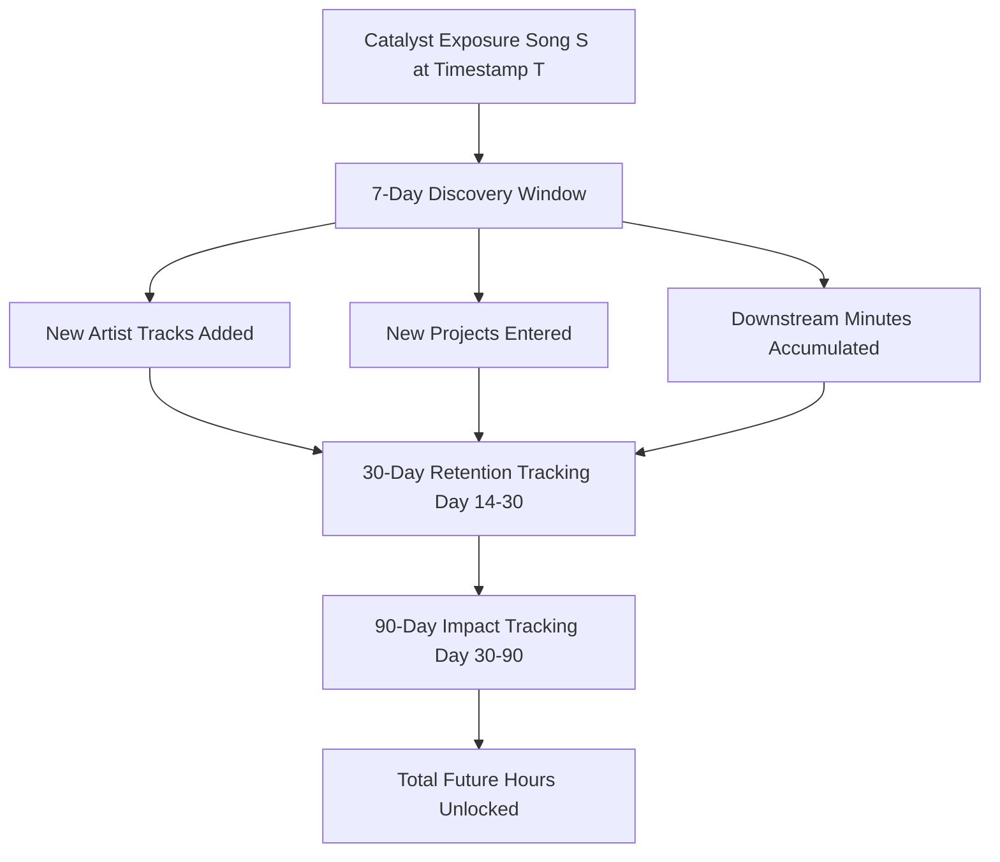

# Discovery Catalyst Engine Methodology

## 1. Flagship Analytical Concept

Rather than requiring an immediate consecutive transition ($A \to B$ immediately), the **Discovery Catalyst Engine** models discovery dynamics over a forward **7-Day Catalyst Window** $[T, T + 7\text{ days}]$:

---

## 2. Four Discovery Taxonomies

1. **Artist Discovery**:
   - The artist was never heard prior to timestamp $T$ ($artist\_plays\_before = 0$).
2. **Project Discovery**:
   - The artist is known, but the listener enters a new album/EP for the first time ($is\_first\_project\_play = True$).
3. **Catalog Deepening**:
   - The artist and project are known, but this playback is followed by expansion into $\ge 2$ previously unheard tracks in the following 7 days.
4. **Re-engagement**:
   - An artist who had been inactive for $\ge 45$ days returns to active rotation following this exposure.

---

## 3. Real Dataset Verification

### Case 1: Panther — *Aa Jao*
- **Actual Event Timestamp**: 2024-07-24 09:02:18 UTC
- **Discovery Classification**: Catalog Deepening
- **7-Day Impact**: 19 new Panther tracks heard, 110.34 additional listening minutes.
- **30-Day Impact**: 217.65 listening minutes, 30D retention verified.
- **Downstream Hours Unlocked**: **32.57 hours**.

### Case 2: Frappe Ash — Catalog Exploration
- **46 Discovery & Re-engagement Events** detected across catalog.
- Catalysts such as *Surma*, *Karein Kya*, *Downlow*, and *Jungle* expanded discography listening, unlocking **33.18 hours** of downstream listening.
