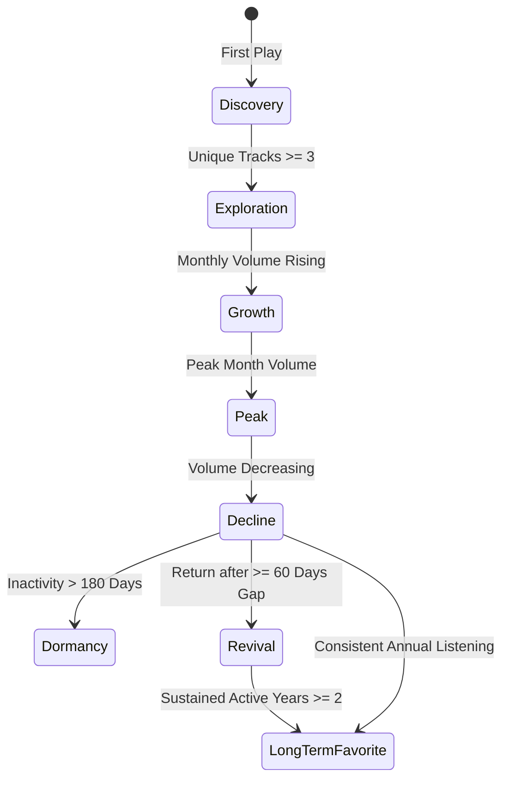

# Song & Artist Lifecycle Methodology

## 1. Artist Lifecycle Trajectory

The system tracks every artist across discrete behavioral states:

### Metrics:
- **Time to Peak**: Days elapsed from first recorded exposure to peak monthly listening.
- **Inactivity Gap**: Maximum duration in days between consecutive plays.
- **Revival Count**: Number of times listening resumed after a gap $\ge 60$ days.

---

## 2. Song Lifecycle Dynamics

Every track is categorized into distinct lifecycle states:
- **Obsession Track**: $\ge 20$ plays with $\ge 8$ plays in the first 7 days.
- **Evergreen Favorite**: Sustained active listening across 3+ calendar years.
- **Heavy Rotation**: $\ge 15$ plays and active within the past 60 days.
- **Revived Track**: $\ge 10$ plays with a gap $\ge 90$ days before return.
- **Failed Discovery**: $\le 2$ plays with a high skip rate ($\ge 50\%$) or raw lifespan $\le 1$ day.

### Raw Lifespan vs Active Lifespan
- **Raw Lifespan**: $T_{last} - T_{first}$ in days.
- **Active Lifespan**: Sum of active listening periods, excluding prolonged gaps $> 45$ days.
  - *Example*: A track played once in 2020 and once in 2026 has a raw lifespan of 2,200 days, but an active lifespan of 0 days.
